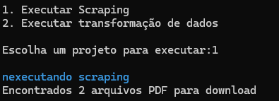

# Este projeto consiste em um desafio técnico onde diferentes módulos são responsáveis por diferentes funcionalidades

## Estrutura do Projeto

- `main.py`: Arquivo principal para gerenciar a execução dos diferentes módulos.
- `scraping.py`: Módulo de scraping para coletar dados.
- `transformacao.py`: Módulo para transformar os dados extraídos.

## Como Baixar o Repositório

1. **Clone o repositório para a sua máquina local**:

    Abra o terminal (ou prompt de comando) e digite o seguinte comando para clonar o repositório:

    ```bash
    git clone https://github.com/l1Beatriz/intuitive-care.git
    ```

2. **Entre no diretório do repositório clonado**:

    Após o download, entre no diretório do projeto:

    ```bash
    cd NOME_DO_REPOSITORIO
    ```

## Pré-requisitos

Antes de executar o projeto, certifique-se de que os seguintes pré-requisitos estão instalados:

- **Python 3.6 ou superior**: Verifique a versão do Python com o comando:

    ```bash
    python --version
    ```

- **Bibliotecas do Python**: O projeto depende de bibliotecas externas que estão listadas no arquivo `requirements.txt`.

### Instalando as dependências

Se você ainda não tiver as dependências instaladas, execute o seguinte comando para instalar todas as bibliotecas necessárias:

```bash
pip install -r requirements.txt
````

## Como Executar o Projeto

- **Navegue até a pasta `src`:**
  
  ```bash
  cd src
  ````
- **Execute o arquivo principal(`main.py`):**
  
  ```bash
  python main.py
  ````

## Saida Final

Ao rodar o comando python `main.py`, o script irá listar as opções de módulos que você pode executar. 
Isso permite que você escolha qual módulo deseja rodar.


